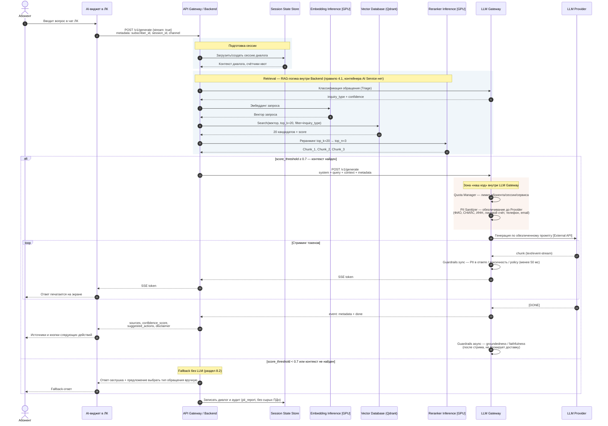
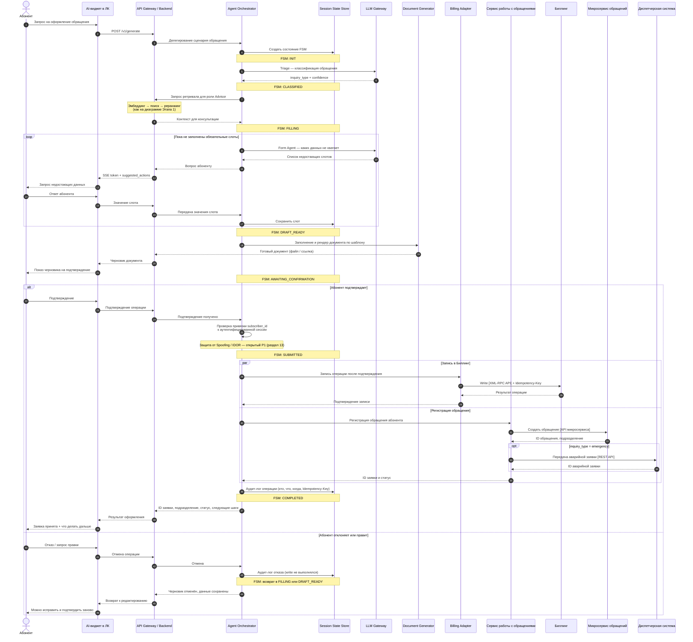

# Диаграммы последовательностей — AI-помощник абонента водоканала

**Версия:** 1.1 · **Дата:** 30 августа 2026

> **Основной артефакт сдачи — `C4_Sequence_Diagrams.html`** (draw.io, 2 страницы: «Этап 1 — streaming
> RAG» и «Этап 2 — write-сценарий с HITL»), в одном формате с `C4_L1_Context.html` и
> `C4_L2_mul_ag_1.html`. Этот файл — та же логика в Mermaid плюс разбор расхождений (раздел 2.2, 3);
> при правках держать оба в синхроне, draw.io считать источником истины по картинке.

Закрывает открытый P1-пункт, стоявший с версии 4.0 контекста (раздел 27, пункт 7): до этого момента
единственным описанием последовательности вызовов был текст разделов 6.1 и 6.3, отдельного
диаграммного артефакта не существовало ни разу за историю проекта.

**Источник истины для участников и связей** — `C4_L2_mul_ag_1.html` (правило 4.1). Ни один участник
ниже не введён сверх того, что есть на L2; ни одна связь не нарисована в обход L2.

Две диаграммы намеренно разделены — это же закрывает находку **F3** (раздел 25.1): на L2 потоки Этапа 1
(шаги 1–3) и Этапа 2 (шаги 4–7c) пронумерованы одной сквозной серией на одном рисунке и читаются как
единый семишаговый вызов, хотя по правилам стадийности (разделы 16–17) это два разных, стадийно
разнесённых сценария. Здесь у каждого своя нумерация с единицы.

---

## 1. Этап 1 — streaming RAG-запрос

Сценарий: абонент задаёт вопрос, получает ответ по базе знаний потоком, с источниками и
`suggested_actions`. Write-операций нет (раздел 3, «На этапе 1 нет write-операций в биллинг и
автоотправки заявок»).

### 1.1. Что диаграмма фиксирует явно

| Требование | Где на диаграмме |
|---|---|
| Правило 4.1 — контейнера `AI Service` нет | Retrieval целиком внутри Backend; отдельного участника-оркестратора на Этапе 1 не существует |
| Правило 4.2 — PII только в LLM Gateway, до провайдера | `PII Sanitizer` стоит между Quota Manager и вызовом Provider, не после ответа |
| Правило 4.3 — Streaming Loop обязателен | Блок `loop` доводит каждый токен до абонента: `P → G → B → W → U` |
| Правило 4.4 — минимальный API | Только `POST /v1/generate`; `/models` не вызывается |
| Guardrails (раздел 35) | Sync-проверка внутри цикла стриминга (менее 50 мс, обрыв потока при нарушении); async-оценка groundedness — после `[DONE]`, чтобы не нарушать правило 4.3 |
| Fallback (раздел 8.2) | Ветка `else` — ответ без вызова LLM при `score_threshold < 0.7` |
| Аудит без сырых ПДн (правило 4.2) | Последний шаг: в Session State Store пишется `pii_report`, не исходный текст |

### 1.2. Расхождения, вскрытые при построении диаграммы

**Р1 [P2] — `top_k` расходится между документами.** Раздел 6.1 контекста описывает шаг как
`Search(embedding, top_k=3, filter=inquiry_type)`, и раздел 8.2 тоже фиксирует `top_k = 3`. Но
`C4_L2_mul_ag_1.html` и раздел 5.5 описывают двухступенчатый ретривал: `top_k=20 → реранжинг →
top_n=3`. На диаграмме взят вариант L2 как источника истины (правило 4.1). Разделы 6.1 и 8.2 нужно
поправить: `top_k=20` — это ширина выборки из Vector DB, `top_n=3` — сколько чанков уходит в промпт.

**Р2 [P2] — шаг классификации не описан в раздел 6.1.** Раздел 3 требует на Этапе 1 «определить тип
обращения» (шаг 2 сценария), и `inquiry_type` используется как фильтр Vector DB — значит,
классификация обязана произойти до поиска. Но в пошаговом описании раздела 6.1 этого шага нет: там
сразу `Search(..., filter=inquiry_type)`, откуда взялось значение — не сказано. На диаграмме шаг
показан явно как вызов Backend → LLM Gateway. Раздел 6.1 нужно дополнить.

**Р3 [P3] — обработка ошибок в сценарии не отражена ни в одном документе.** Правило 4.5 требует
RFC 7807 на всех ошибках, раздел 7.4 перечисляет коды (400/401/429/502/504), а Quota Manager обязан
вернуть `429 + Retry-After` (раздел 35.1). Но текстовые сценарии разделов 6.1 и 6.3 описывают только
happy path. На диаграмме выше показан отказ по `score_threshold`, но не показаны отказы по квоте,
таймауту провайдера и блокировке Guardrails — иначе диаграмма становится нечитаемой. Это стоит
вынести в отдельную диаграмму ошибок или в таблицу переходов при написании `api.py` (код-шаг 8).

---

## 2. Этап 2 — агентный сценарий с write-операциями

Сценарий: абонент оформляет обращение, система собирает слоты, формирует черновик, получает
подтверждение и только после него выполняет запись. Стадийное ограничение: Этап 2 не внедряется до
готовности метрик Этапа 1 (разделы 16–17, правило 9 раздела 19).

Ретривал внутри этого сценария не раскрывается повторно — он идентичен блоку Retrieval диаграммы
Этапа 1.

### 2.1. Что диаграмма фиксирует явно

| Требование | Где на диаграмме |
|---|---|
| Правило 4.7 — HITL перед любой write-операцией | Ни одного вызова к `BA` / `IS` до состояния `AWAITING_CONFIRMATION` и явного подтверждения абонента |
| Идемпотентность | `Idempotency-Key` на записи в Биллинг; ID обращения возвращается микросервисом |
| Аудит-лог | Пишется и при подтверждении, и при отказе — отказ тоже событие аудита |
| Возможность отмены (раздел 3) | Ветка `else`: возврат в `FILLING` / `DRAFT_READY` без потери собранных слотов |
| Находка F4 закрыта (раздел 25.1) | `D -->> B` — готовый документ возвращается в Backend и доходит до абонента, а не обрывается на Document Generator |
| Правило доступа к внешним системам (раздел 29.5) | `BA → BIL` через XML-RPC API, `IS → MO` через API микросервиса — ни одного прямого обращения в чужую БД |
| Диспетчерская — оба потока | Здесь показан write (`emergency`); read для ответа абоненту — это Этап 1, диаграмма 1 |
| FSM раздела 10 | Все семь состояний размечены `Note over O,S` в точках перехода |

### 2.2. Расхождения, вскрытые при построении диаграммы

**Р4 [P1] — проверка `subscriber_id` показана, но не реализована нигде.** Риски Spoofing и IDOR
внесены в реестр (раздел 13) ещё в версии 4.0, но защитной меры под них нет ни в одном документе.
На диаграмме шаг присутствует и явно помечен как открытый. Пока это требование к коду (шаг 9,
`adapters/`), а не описанное решение.

**Р5 [P2] — раздел 6.3 не упоминает Document Generator в пути доставки.** Пошаговое описание
(шаги 5–6: «система формирует черновик», «система показывает черновик абоненту») не говорит, кто
именно рендерит и как документ попадает к абоненту. Это та же находка F4, только со стороны текста, а
не диаграммы. Раздел 6.3 нужно дополнить.

**Р6 [P2] — параллельность двух write-путей не определена.** Раздел 6.3 (шаг 8) перечисляет запись в
Биллинг и отправку заявки как два действия подряд, не уточняя, идут они параллельно или
последовательно и что делать, если первое прошло, а второе упало. На диаграмме показан `par` как более
вероятное намерение, но **компенсация при частичном отказе не спроектирована** — это открытый вопрос
уровня саги/двухфазного подтверждения, который нужно решить до кодирования шага 9.

**Р7 [P3] — `emergency` как условие ветвления взято по смыслу.** Условие `inquiry_type = emergency`
для передачи в Диспетчерскую систему выведено из таксономии (раздел 9.3) и из роли Диспетчерской
(раздел 5.1), но нигде не зафиксировано как правило маршрутизации. Нужна явная таблица соответствия
`inquiry_type` → целевая система, иначе при кодировании она будет придумана заново.

---

## 3. Итог и следующие шаги

**Закрыто этим артефактом:**

- Открытый P1-пункт раздела 27 (пункт 7) — sequence-диаграммы существуют, впервые за историю проекта.
- Находка **F3** (раздел 25.1) — потоки Этапа 1 и Этапа 2 разнесены на две диаграммы со своей
  нумерацией; на L2 сквозную серию `1…7c` теперь можно либо убрать, либо переразметить ссылкой на
  соответствующую диаграмму.
- Находка **F4** — путь доставки документа абоненту показан явно (на L2 связь уже добавлена).
- Требования разделов 4.2, 4.3, 4.7 и раздела 35 (Security Layer) сведены в один проверяемый сценарий.

**Открыто и требует решения:**

| # | Что | Приоритет | Куда |
|---|---|---|---|
| Р1 | `top_k=3` в разделах 6.1 и 8.2 против `top_k=20 → top_n=3` на L2 | P2 | правка контекста |
| Р2 | Шаг классификации отсутствует в разделе 6.1 | P2 | правка контекста |
| Р3 | Сценарии ошибок (429, 502, 504, блокировка Guardrails) нигде не описаны | P3 | отдельная диаграмма или таблица к `api.py` |
| Р4 | Проверка `subscriber_id` на write-шаге не реализована | P1 | код-шаг 9 |
| Р5 | Раздел 6.3 не описывает доставку документа | P2 | правка контекста |
| Р6 | Компенсация при частичном отказе двух write-путей не спроектирована | P2 | решить до код-шага 9 |
| Р7 | Правило маршрутизации `inquiry_type` → целевая система не зафиксировано | P3 | таблица в разделе 9 |

**Дальше по Build_Plan (Фаза 1):** C3 для Backend и AI-виджета, ER-диаграмма, деплой-схема.

